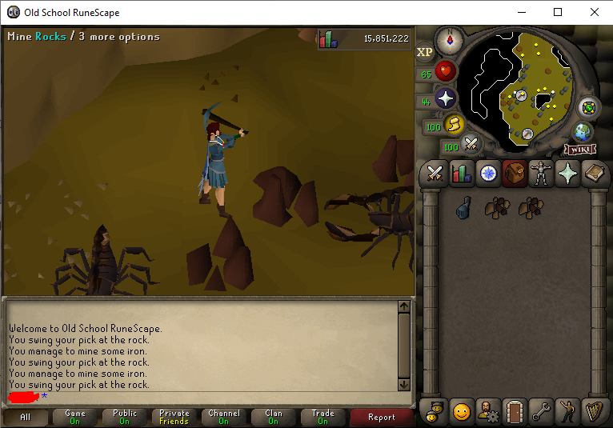
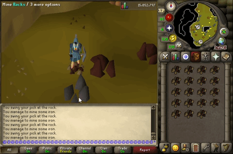
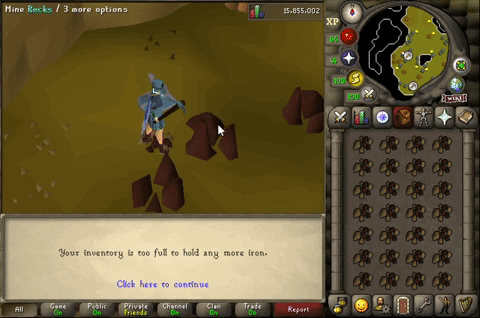
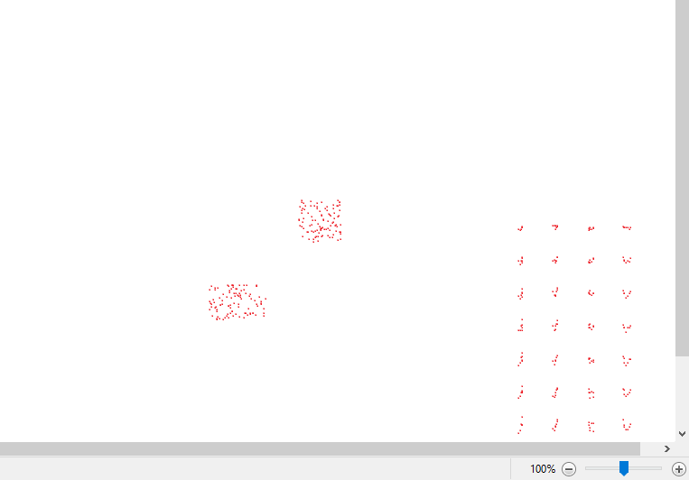
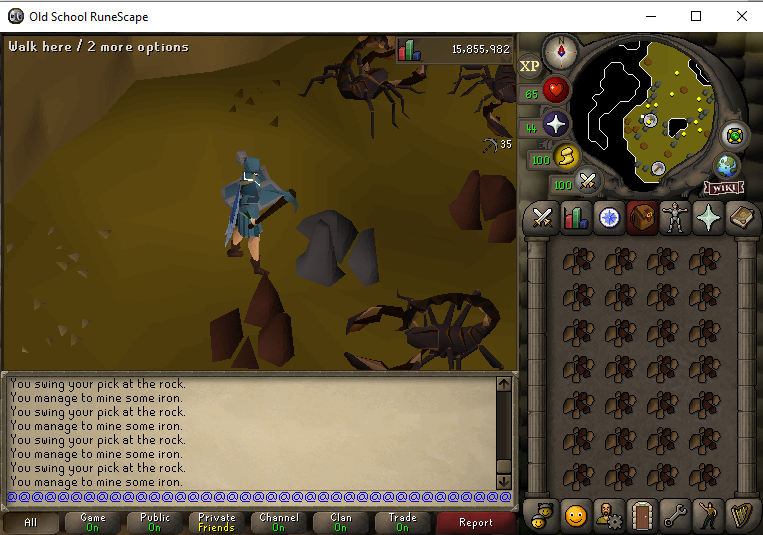
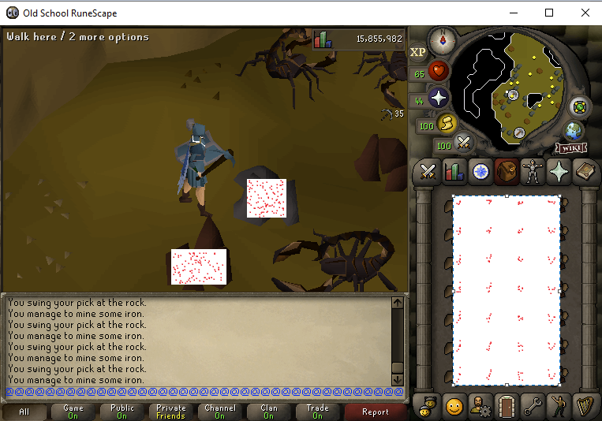

# Oldschool Runescape Mining bot

## Funcionalidades

- Mineirar e dropar iron no Oldschool Runescape para aumentar o nível de Mining.
- clicks e intervalos randomizados entre uma ação e outra para evitar banimentos.
### Mineirando 

### Dropando (esvaziando o inventário)

## Demonstração da funcionalidade de clicks randomizados

- Bot usado no Paint para demonstrar os pixeis randômicos.

 

## Possíveis upgrades no bot

- Reconhecimento por imagem para padronizar o bot (atualmente tem que ser ajustável de acordo com o tamonho do monitor do usuário e posicionamento do client do jogo).
- GUI.
